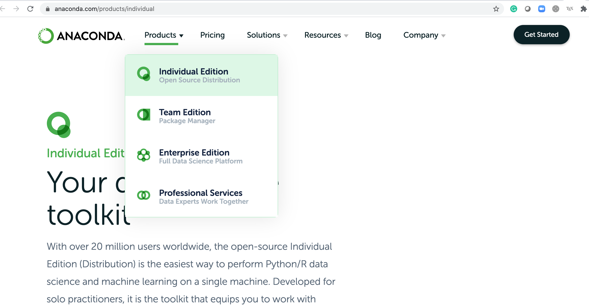
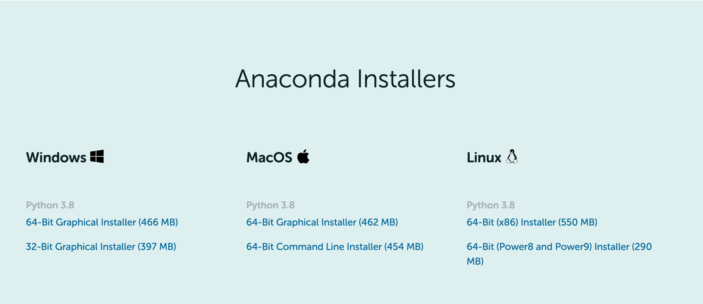

## Configure Python environment through Anaconda
Python is an increasingly popular high-level programming language. It emphasizes legibility over highly complex structure. Python innately provides simple data structures allowing for easy data manipulation. Python provides a simple approach to object-oriented programming, which in turn allows for intuitive programming, and has resulted in a large user community that has created numerous libraries that extend the basic capacities of the language.

The Anaconda makes configuring Python programing environment super easy. The Anaconda is cross-platform and it is very easy to install different libraries in the virtual environment. The following tutorial will walk you through the tutorial for installing Anaconda and required Python modules.

##1. Install Anaconda
Go to the [website](https://www.anaconda.com/products/individual) to download Anaconda for different OSs. 

Select the right Anaconda for your computer. In this tutorial, we are going to use Python 3.8. 

Locate

##2.The command mode shortcuts
(1) go to the next line, press `enter` button
run the current cell and move the next cell, press `shift + enter`

(2) save the notebook, press `s`

(3) change cell type, `y`, `m`, You can switch between edit mode and command mode by press `y` or `m` button

(4) create cell above `a` and below `b`

(5) cell editing, cut cell press `x`, copy cell press `c`, paste cell press `v`, delete cell press `dd`, cancel previous step press `zz`

(6) Kernel operation, Restart the jupyter server by pressing `0` twice; Interrupt the running cell by pressing `i` twice.

#### Reference
1. Jupyter notebook for beginners, https://realpython.com/jupyter-notebook-introduction/
2. Notebook Basics, https://jupyter-notebook.readthedocs.io/en/stable/examples/Notebook/Notebook%20Basics.html
